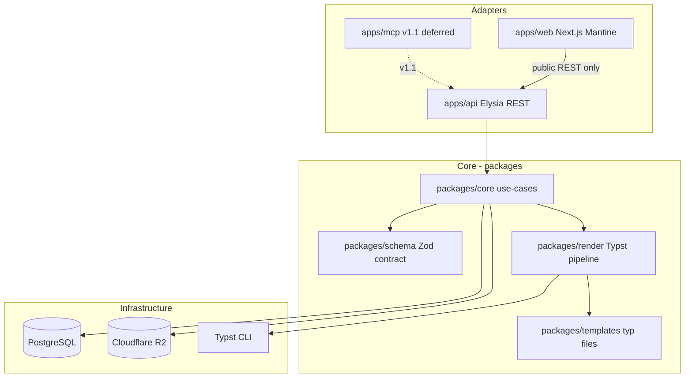
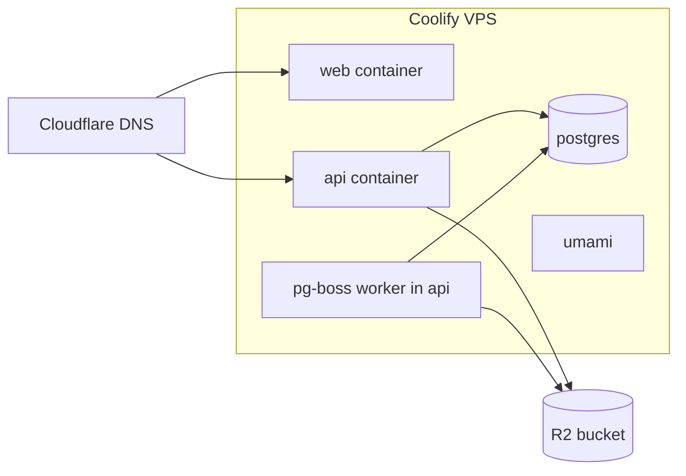

# Architecture Spine — usetagih

## Design Paradigm

**Hexagonal (ports-and-adapters).** The product core — canonical Zod contract + deterministic render pipeline — lives in `packages/schema` and `packages/render` with zero knowledge of HTTP, UI, or storage drivers. Adapters (`apps/api`, `apps/web`, future `apps/mcp`) call inward through typed application services in `packages/core`. Infrastructure (Drizzle repos, R2 client, Typst subprocess, webhook dispatcher) implements outbound ports.



## Invariants & Rules

### AD-1 — Single canonical contract

- **Binds:** FR-1, FR-2, FR-3, FR-4, FR-31; PRD §10.1
- **Prevents:** Divergent validation between API, SDK, and web forms
- **Rule:** All payload parsing, business-rule checks, and OpenAPI component generation import exclusively from `packages/schema`. No duplicate Zod definitions in apps. `schemaVersion` default `2026-07-20`; breaking changes require new version string + semver major on `@usetagih/schema`.

### AD-2 — REST API is the sole business boundary

- **Binds:** FR-11..FR-17, FR-28..FR-30; UX architecture constraint
- **Prevents:** Web app or MCP implementing render/validation logic outside the API
- **Rule:** `apps/web` calls the same public REST endpoints as integrators (`Authorization: Bearer` session-derived token or cookie-proxied API token). No internal-only routes that skip validation, idempotency, or audit. MCP (v1.1) is a thin HTTP client wrapper — max 5 tools, zero render logic.

### AD-3 — Deterministic render via Typst

- **Binds:** FR-6..FR-9, FR-7, NFR-1, NFR-6; SM-1, SM-3
- **Prevents:** Byte drift from browser engines; OOM from headless Chromium on 12 GB VPS
- **Rule:** PDF output uses Typst CLI with pinned font bundle, `--ignore-system-fonts`, fixed `SOURCE_DATE_EPOCH`, and version-pinned Typst binary in Docker. Preview compiles the **same** `.typ` template to SVG (or embeds generated PDF) — never a separate HTML layout engine. Golden-file CI compares SHA-256 of PDF bytes; intentional drift requires fixture PR + visual review.

### AD-4 — Sync/async render contract

- **Binds:** FR-12, FR-24, FR-26; PRD §10.2, §11 OQ-3
- **Prevents:** Ad-hoc background threads; unbounded sync blocking
- **Rule:** ≤100 line items + completes within 10s → sync `201`. Else `202` (`>100` items, timeout, or `Prefer: respond-async`). Hard cap 500 line items at validation. Async work enqueued to Postgres-backed job queue; worker process co-located with API container on VPS.

### AD-5 — Idempotency and financial integrity

- **Binds:** FR-2, FR-9, FR-24; PRD §10.1 arithmetic rules
- **Prevents:** Silent total correction; duplicate renders on retry
- **Rule:** Hash `Idempotency-Key` + `accountId` + endpoint; store response snapshot ≥24h. Same key + different payload → `409`. Validation rejects `LINE_TOTAL_MISMATCH`, `TAX_TOTAL_MISMATCH` before render. Displayed PDF values mirror payload — never recomputed at render time.

### AD-6 — Artifact and share-link lifecycle

- **Binds:** FR-18..FR-20, FR-19
- **Prevents:** Orphan R2 objects; conflated TTL policies
- **Rule:** PDF stored at `renders/{accountId}/{renderId}.pdf` in R2; metadata + checksum in PostgreSQL. Share URLs are HMAC-signed with TTL (default 90d, per-render `shareTtlDays` 1–365). `DELETE /v1/renders/{renderId}/share` revokes; no reissue. Artifact retention ≥ share TTL + 7d grace; cleanup job deletes R2 object after retention, retains audit metadata.

### AD-7 — Auth, API keys, audit

- **Binds:** FR-21..FR-23, FR-27; NFR-5, NFR-11
- **Prevents:** Plaintext key storage; cross-tenant leakage
- **Rule:** better-auth for web sessions (email/password + GitHub OAuth). API keys scoped (`renders:read`, `renders:write`, `webhooks:manage`, `audit:read`); hashed at rest (argon2); show-once on create. All mutating actions append audit row. Cross-tenant resource access returns `404`.

### AD-8 — Webhook delivery semantics

- **Binds:** FR-25, FR-26; PRD §10.5
- **Prevents:** Incompatible retry/dedup behavior across workers
- **Rule:** 8 attempts ~24h (30s, 2m, 10m, 30m, 1h, 3h, 8h, 12h) + jitter. Stable `eventId` per event. HMAC-SHA256 `X-Usetagih-Signature` over `timestamp + "." + rawBody` per PRD §10.5. Retry on network/`408`/`429`/`5xx` only. Auto-disable endpoint after 7 consecutive days 100% failure. Every attempt audit-logged.

### AD-9 — Frontend framework

- **Binds:** FR-28..FR-30, NFR-9; UX EXPERIENCE.md
- **Prevents:** Framework mismatch with Mantine v8; over-coupled server logic in web tier
- **Rule:** `apps/web` uses **Next.js 15 App Router** + Mantine v8. Client components for interactive UI; SSR for `/`, `/share/[token]`, auth pages. All document operations via `@usetagih/sdk` or fetch to public API base URL — no server actions that bypass API validation.

### AD-10 — Epic-1 spike gate

- **Binds:** NFR-6; board mandate
- **Prevents:** Broad feature work before PDF determinism proven
- **Rule:** No epic beyond spike merges until `packages/render` produces byte-stable invoice/`modern` PDF from fixture, golden SHA-256 passes in CI Docker job `pdf-golden`. Spike delivers: Typst template, font bundle, harness CLI, one fixture, CI workflow stub.

### AD-11 — Error envelope uniformity

- **Binds:** FR-2, NFR-7; PRD §10.3
- **Prevents:** Inconsistent client error handling
- **Rule:** All API errors use `{ error: { code, message, requestId, details[] } }`. One code → one HTTP status. SDK and web map `details[].path` to form fields.

### AD-12 — Schema versioning policy

- **Binds:** FR-3, NFR-10
- **Prevents:** Breaking changes without migration path
- **Rule:** Support N and N-1 schema versions for 90 days. `GET /v1/schemas` is authority. SDK warns when bundled version ≠ server version.

## Consistency Conventions

| Concern | Convention |
| --- | --- |
| Naming (entities) | `renderId` prefix `rnd_`, `eventId` `evt_`, `requestId` `req_`, `apiKeyId` `key_`; ULID/UUIDv7 internally |
| Naming (files) | kebab-case files; PascalCase React components; camelCase TS exports |
| Naming (env vars) | `USETAGIH_` prefix for app secrets; `DATABASE_URL`, `R2_*` S3-compatible names |
| Data & formats | Money = decimal string; dates ISO 8601 date; currency ISO 4217; errors JSON Pointer paths |
| IDs in DB | PostgreSQL `uuid` primary keys; idempotency stored as SHA-256 hash of key |
| State mutation | Use-cases in `packages/core` own transactions; repos never called from route handlers directly |
| Logging | Structured JSON via `pino`; fields: `requestId`, `accountId`, `renderId`, `stage`, `durationMs` |
| Auth | API: `Authorization: Bearer <api_key>`. Web: better-auth session cookie; BFF optional proxy adds Bearer for API calls |
| Config | Doppler project `usetagih`; configs `dev`, `staging`, `prod` — never commit secrets |

## Stack

| Name | Version |
| --- | --- |
| Runtime | Bun 1.2.x |
| Monorepo | turborepo 2.x |
| Language | TypeScript 5.8+ |
| API framework | Elysia 1.4.29 (compiled to `dist/`) |
| Contract | Zod 4.x + `@asteasolutions/zod-to-openapi` |
| ORM | Drizzle ORM 0.40+ |
| Database | PostgreSQL 16 |
| Auth | better-auth 1.x |
| Web | Next.js 15.x, React 19, Mantine 8.x |
| PDF engine | Typst 0.13.x (pinned binary) |
| Object storage | Cloudflare R2 (S3 API) |
| Queue | pg-boss 10.x (Postgres-backed) |
| Unit/integration test | bun test |
| E2E | Playwright 1.52+ |
| Lint/format | Biome + ultracite |
| Secrets | Doppler |
| Analytics | umami (self-hosted) |
| Deploy | Docker + Coolify on Contabo VPS |
| CI | GitHub Actions |

## Structural Seed

```text
usetagih/
  apps/
    api/                 # Elysia REST + OpenAPI + workers entry
    web/                 # Next.js 15 Mantine consumer
    mcp/                 # v1.1 placeholder — package.json stub only at MVP
  packages/
    schema/              # Canonical Zod + OpenAPI export
    core/                # Use-cases: validate, render, webhook, idempotency
    render/              # Typst driver, golden harness, font bundle
    templates/           # .typ templates (invoice|quotation|receipt × modern|classic)
    sdk/                 # @usetagih/sdk npm client
    db/                  # Drizzle schema, migrations, client
    config/              # Shared tsconfig, biome, env validation
    ui/                  # Shared Mantine theme tokens from DESIGN.md (optional v1)
  docker/
    Dockerfile.api
    Dockerfile.web
    Dockerfile.render-ci # Typst + fonts for golden tests
    compose.yml          # postgres, minio, api, web
  .github/workflows/
    ci.yml
    pdf-golden.yml
  turbo.json
  doppler.yaml           # project mapping doc
```



## Capability → Architecture Map

| Capability / Area | Lives in | Governed by |
| --- | --- | --- |
| Canonical contract | `packages/schema` | AD-1, AD-12 |
| Validation + business rules | `packages/core/validate` | AD-1, AD-5 |
| PDF render | `packages/render` + `packages/templates` | AD-3, AD-10 |
| REST API | `apps/api` | AD-2, AD-4, AD-11 |
| Async jobs + webhooks | `apps/api/worker` + `packages/core/jobs` | AD-4, AD-8 |
| Artifacts + share URLs | `packages/core/artifacts` | AD-6 |
| Auth + API keys | `apps/api/auth` + better-auth | AD-7 |
| Audit log | `packages/core/audit` | AD-7, AD-8 |
| Web UI | `apps/web` | AD-2, AD-9 |
| TS SDK | `packages/sdk` | AD-1, AD-2 |
| Golden-file CI | `packages/render/__fixtures__` + `.github/workflows/pdf-golden.yml` | AD-3, AD-10 |
| MCP adapter | `apps/mcp` (v1.1) | AD-2 |

## Deferred

| Item | Reason |
| --- | --- |
| `apps/mcp` implementation | v1.1 per PRD; REST must stabilize first |
| Webhook management UI | API-only at MVP per UX spine |
| JSON payload import in web | Post-MVP |
| Redis / separate queue broker | Postgres queue sufficient on single VPS until proven otherwise |
| Multi-region / HA | MVP 99.5% on single VPS |
| Enterprise SLA tier | Post-MVP waitlist |
| Non-English localization | Explicit non-goal |
| Pixel-fallback golden tests | Only if Typst byte-stable harness fails a edge case — spike validates first |
