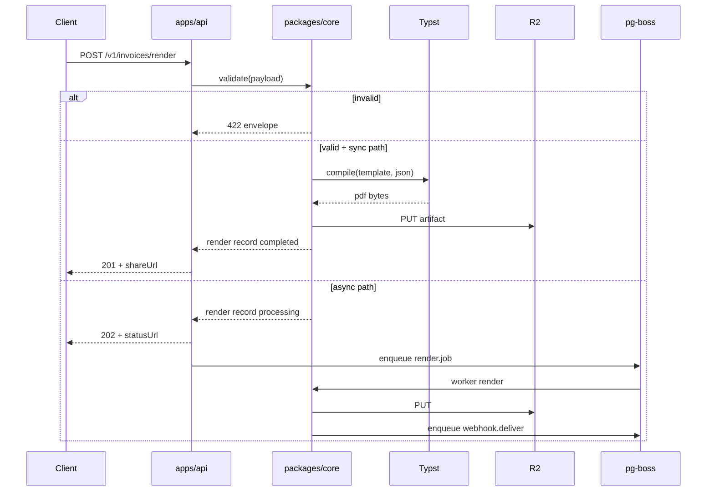
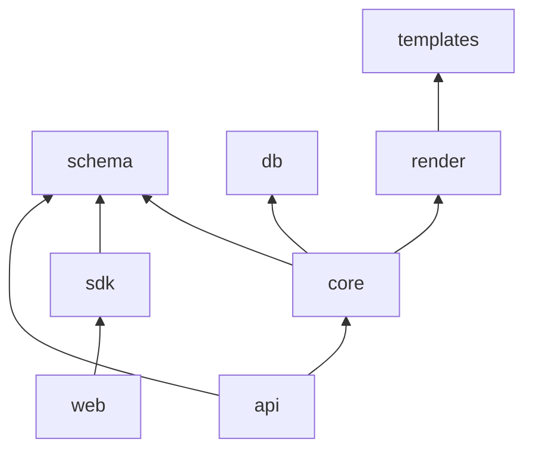
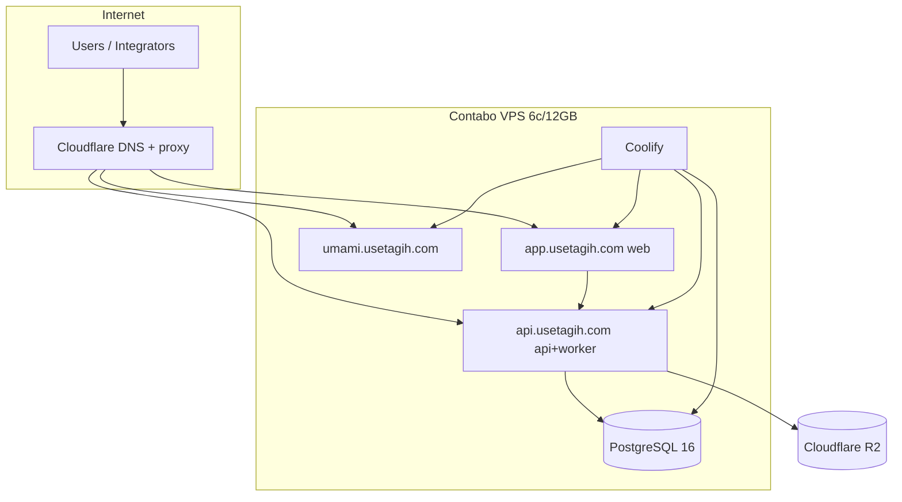

# Solution Design: usetagih

Operational and implementation detail for agents building from `ARCHITECTURE-SPINE.md`. PRD §10 is frozen — this document implements it.

## 1. Big Choices (Rationale Summary)

### 1.1 Frontend: Next.js 15 App Router

| Criterion | Next.js 15 | TanStack Start |
| --- | --- | --- |
| Mantine v8 | Official templates + guides | Community template only |
| Coolify deploy | Standard standalone Docker pattern | Nitro/Bun compile — fewer Coolify recipes |
| Public-API consumer | Client fetch + optional route handlers as thin BFF | Server functions tempt business logic duplication |
| Bun monorepo | Dev via Bun; prod Node standalone (acceptable) | Native Bun runtime |
| Share page SSR | App Router SSR for `/share/[token]` | Supported via TanStack Start SSR |

**Decision:** Next.js 15 App Router. The web app is a thin Mantine consumer of the public REST API; Mantine's first-class Next integration and Coolify deployment path outweigh TanStack Start's Bun-native runtime for this workload.

### 1.2 PDF Engine: Typst CLI 0.13.x

| Criterion | Typst | Playwright print-to-PDF | @react-pdf/renderer |
| --- | --- | --- | --- |
| Byte-identical (FR-7) | Yes with pinned fonts + `SOURCE_DATE_EPOCH` | No — metadata/timestamps vary | No — known non-deterministic bytes |
| NFR-1 P95 ≤2s | 5–50ms compile warm | 1–5s+ cold Chromium | ~100–500ms |
| 12 GB VPS memory | ~40 MB binary, no browser pool | 200–400 MB per Chromium | Moderate |
| Pagination (FR-8) | Native paged media | CSS print quirks | Known pagination bugs |
| Template DX (6 templates) | `.typ` + JSON `--input` | HTML/CSS React components | JSX layout components |
| Preview = same engine (FR-10) | Compile same `.typ` → SVG pages | Same HTML | N/A for preview |

**Decision:** Typst CLI with vendored fonts in `packages/render/fonts/`. Preview endpoint returns `text/html` wrapping Typst-compiled SVG (multi-page via `<div class="page">` per SVG). PDF path runs `typst compile` with identical template + input JSON.

**Rejected Chromium:** Memory footprint and byte-instability on shared VPS violate FR-7/NFR-1 unless accepting pixel-golden fallback (deferred).

**Rejected @react-pdf:** Non-deterministic PDF bytes and pagination instability at 25+ line items fail FR-7/FR-8 gates.

---

## 2. Epic-1 Spike (Mandatory Gate)

**Epic:** `E1-pdf-pipeline-spike`  
**Goal:** Prove Typst renders `invoice` + `modern` template deterministically before any other feature epic merges.

### 2.1 Deliverables

| # | Artifact | Path |
| --- | --- | --- |
| 1 | Typst invoice modern template | `packages/templates/invoice/modern.typ` |
| 2 | Shared Typst preamble (fonts, colors, footer watermark) | `packages/templates/_shared/preamble.typ` |
| 3 | Font bundle (Inter + JetBrains Mono OFL) | `packages/render/fonts/` |
| 4 | Fixture payload (≤5 line items, USD, single tax) | `packages/render/__fixtures__/invoice-modern-basic.json` |
| 5 | Golden PDF + SHA-256 manifest | `packages/render/__fixtures__/golden/invoice-modern-basic.sha256` |
| 6 | Harness CLI | `packages/render/scripts/golden-check.ts` |
| 7 | CI Docker image | `docker/Dockerfile.render-ci` |
| 8 | CI workflow | `.github/workflows/pdf-golden.yml` |

### 2.2 Spike Acceptance Criteria

- [ ] `bun run golden:check` exits 0 locally and in CI Docker
- [ ] Re-run produces identical SHA-256 (byte-stable)
- [ ] Footer watermark renders for `tier=free` flag in template input
- [ ] 25-line-item pagination fixture added as stretch (not blocking spike merge if ≤5 passes)
- [ ] Documented Typst version pin in `packages/render/typst-version.txt`

### 2.3 Spike → Production Path

Spike harness becomes permanent NFR-6 gate. Adding template = add fixture + golden hash PR.

---

## 3. Golden-File Test Architecture

### 3.1 Fixture Corpus Layout

```text
packages/render/__fixtures__/
  payloads/
    invoice-modern-basic.json
    invoice-modern-pagination-25.json
    invoice-classic-multi-tax.json
    quotation-modern-jpy.json
    receipt-classic-inclusive-tax.json
    # ... 3 types × 2 templates × scenarios
  golden/
    invoice-modern-basic.pdf          # committed reference (optional — prefer hash-only)
    invoice-modern-basic.sha256
    manifest.json                     # { file, sha256, typstVersion, schemaVersion }
```

### 3.2 Tolerance Policy

| Check | Policy |
| --- | --- |
| Primary | SHA-256 byte equality of PDF bytes |
| Date fields | Fixed `issuedAt` in fixtures; `SOURCE_DATE_EPOCH=1700000000` in CI |
| Fonts | `--ignore-system-fonts`; only `packages/render/fonts/` |
| Typst version | Pinned in Docker CI image; bump requires manifest update |
| Logo URLs | Fixtures use embedded base64 logo in JSON or local `file://` stub — no network in CI |
| Failure | CI blocks merge; update golden via PR labeled `golden-update` + visual diff attachment |

### 3.3 Font Pinning

- **UI fonts (web):** Inter, JetBrains Mono via `@fontsource` or Google Fonts link — unrelated to PDF determinism
- **PDF fonts:** vendored TTF/OTF in `packages/render/fonts/` referenced in `preamble.typ` via `#set text(font: "...")`
- **CI reproducibility:** `docker/Dockerfile.render-ci` FROM `debian:bookworm-slim` + pinned Typst `.deb` + copy fonts; no system font packages

### 3.4 Harness Commands

```json
// packages/render/package.json scripts
{
  "golden:render": "bun scripts/render-fixture.ts",
  "golden:check": "bun scripts/golden-check.ts",
  "golden:update": "bun scripts/golden-check.ts --update"
}
```

`golden-check.ts` flow:

1. For each entry in `manifest.json`
2. Render payload → temp PDF via Typst driver
3. SHA-256 compare to golden
4. Exit 1 on mismatch with diff of file sizes + first bytes hex

### 3.5 CI Job (`pdf-golden.yml`)

```yaml
# triggers: push/PR affecting packages/render, packages/templates
jobs:
  pdf-golden:
    runs-on: ubuntu-latest
    container:
      image: ghcr.io/verasic-labs/usetagih-render-ci:2026-07-20  # built from Dockerfile.render-ci
    steps:
      - checkout
      - run: bun install --frozen-lockfile
      - run: bun run --filter @usetagih/render golden:check
    env:
      SOURCE_DATE_EPOCH: "1700000000"
      TYPST_IGNORE_SYSTEM_FONTS: "1"
```

---

## 4. Render Pipeline (Detailed)



### 4.1 Stages

1. **Authenticate** — API key or session-derived token; scope check
2. **Idempotency** — lookup `idempotency_keys` table; return cached response if hit
3. **Validate** — Zod parse + business rules (§10.1 arithmetic)
4. **Resolve branding** — merge account defaults + payload override; fetch `logoUrl` once, store checksum on render record
5. **Render** — build Typst input JSON; invoke `typst compile --input json=<path>`
6. **Store** — upload R2; insert/update `renders` row with `sha256`, `byteSize`, `r2Key`
7. **Share URL** — sign JWT/HMAC token with expiry
8. **Webhook** — if registered, enqueue delivery job
9. **Audit** — append event

### 4.2 Preview Path

`POST /v1/{documentType}/preview`:

- Same validate + branding resolve
- `typst compile --format svg` (or multi-page SVG set)
- Return `{ html: "<div>...</div>", valid: true }` wrapping SVGs
- No R2 persist; no render record (ephemeral)

### 4.3 Free-Tier Watermark

Typst template receives `showWatermark: boolean` from account tier. Footer text: `Rendered with usetagih · usetagih.com` at 8pt gray when true.

---

## 5. Async Job / Queue Mechanism

**Choice:** `pg-boss` on existing PostgreSQL — no Redis.

| Job type | Payload | Concurrency |
| --- | --- | --- |
| `render.process` | `{ renderId }` | 2 workers (VPS CPU headroom) |
| `webhook.deliver` | `{ deliveryId }` | 4 workers |
| `artifact.cleanup` | `{ batchSize }` | cron daily |
| `webhook.sweep-disabled` | `{}` | cron hourly |

**Sync vs async decision** (in render use-case):

```typescript
const forceAsync = preferAsyncHeader || payload.lineItems.length > 100;
// if sync: race render against 10s timeout → on timeout flip to async 202
```

**Hard timeout:** 10s wall clock for sync path; worker uses 120s internal timeout.

---

## 6. Repository Layout (Full)

```text
usetagih/
├── apps/
│   ├── api/
│   │   ├── src/
│   │   │   ├── index.ts              # Elysia app bootstrap
│   │   │   ├── routes/v1/            # validate, render, renders, keys, webhooks, audit, schemas, share
│   │   │   ├── middleware/           # auth, rate-limit, idempotency, request-id
│   │   │   ├── worker.ts             # pg-boss consumer entry
│   │   │   └── openapi.ts
│   │   ├── drizzle/                  # re-export migrations from packages/db
│   │   ├── Dockerfile
│   │   └── package.json              # name: @usetagih/api
│   ├── web/
│   │   ├── app/                      # Next.js App Router
│   │   │   ├── (public)/             # landing, auth, share
│   │   │   └── app/                  # authenticated shell
│   │   ├── components/               # Mantine UI per EXPERIENCE.md screens
│   │   ├── lib/api-client.ts         # wraps @usetagih/sdk
│   │   ├── theme/                    # DESIGN.md tokens → Mantine createTheme
│   │   ├── Dockerfile
│   │   └── package.json              # name: @usetagih/web
│   └── mcp/
│       └── README.md                 # v1.1 stub — "calls REST only"
├── packages/
│   ├── schema/
│   │   ├── src/document/             # Zod discriminated union §10.1
│   │   ├── src/errors/               # error codes enum
│   │   ├── src/openapi/              # OpenAPI 3.1 generator
│   │   └── package.json              # name: @usetagih/schema
│   ├── core/
│   │   ├── src/use-cases/            # validate, render, preview, webhook, idempotency
│   │   ├── src/ports/                # interfaces: RenderRepo, ArtifactStore, Queue
│   │   └── package.json
│   ├── render/
│   │   ├── src/typst-driver.ts
│   │   ├── fonts/
│   │   ├── __fixtures__/
│   │   ├── scripts/golden-check.ts
│   │   └── package.json              # name: @usetagih/render
│   ├── templates/
│   │   ├── invoice/{modern,classic}.typ
│   │   ├── quotation/{modern,classic}.typ
│   │   ├── receipt/{modern,classic}.typ
│   │   └── _shared/preamble.typ
│   ├── sdk/
│   │   ├── src/client.ts             # validateLocally, render, types
│   │   └── package.json              # name: @usetagih/sdk
│   ├── db/
│   │   ├── src/schema/               # Drizzle tables
│   │   ├── migrations/
│   │   └── package.json              # name: @usetagih/db
│   └── config/
│       ├── tsconfig/base.json
│       ├── biome.json
│       └── package.json
├── docker/
│   ├── compose.yml
│   ├── Dockerfile.api
│   ├── Dockerfile.web
│   └── Dockerfile.render-ci
├── .github/workflows/
│   ├── ci.yml
│   └── pdf-golden.yml
├── turbo.json
├── package.json                        # workspaces root
└── doppler.yaml
```

### 6.1 Package Dependency Graph



---

## 7. Database Schema (Drizzle)

### 7.1 Core Tables

| Table | Purpose |
| --- | --- |
| `users` | better-auth managed |
| `accounts`, `sessions`, `verifications` | better-auth |
| `api_keys` | `id`, `user_id`, `name`, `prefix`, `key_hash`, `scopes[]`, `expires_at`, `revoked_at` |
| `renders` | `id`, `user_id`, `document_type`, `template`, `schema_version`, `status`, `idempotency_hash`, `payload_hash`, `r2_key`, `sha256`, `byte_size`, `share_token`, `share_expires_at`, `logo_checksum`, `error_code`, timestamps |
| `idempotency_keys` | `account_id`, `endpoint`, `key_hash`, `request_hash`, `response_body`, `expires_at` |
| `webhooks` | `id`, `user_id`, `url`, `secret_hash`, `events[]`, `disabled_at`, `failure_streak_since` |
| `webhook_deliveries` | `id`, `event_id`, `webhook_id`, `render_id`, `attempt`, `status`, `next_attempt_at`, `response_code` |
| `audit_events` | append-only: `id`, `user_id`, `action`, `resource_type`, `resource_id`, `outcome`, `ip`, `metadata`, `created_at` |
| `account_settings` | branding defaults, business identity, `tier` enum |
| `usage_counters` | monthly render count per account |

### 7.2 Migration Strategy

- **Tool:** Drizzle Kit (`drizzle-kit generate` / `migrate`)
- **Location:** `packages/db/migrations/`
- **Naming:** `YYYYMMDDHHMMSS_description.sql`
- **Local:** `bun run --filter @usetagih/db migrate` against compose Postgres
- **Prod:** run migrate as Coolify pre-deploy hook on `api` container
- **Rollback:** forward-only at MVP; corrective migration if needed
- **Seed:** `packages/db/seed/dev.ts` — test user, sample API key (dev only)

---

## 8. Local Development

### 8.1 Docker Compose (`docker/compose.yml`)

| Service | Image | Ports |
| --- | --- | --- |
| `postgres` | `postgres:16-alpine` | 5432 |
| `minio` | `minio/minio` | 9000 (S3 API), 9001 (console) |
| `createbuckets` | minio mc | creates `usetagih-artifacts` bucket |
| `api` | build `Dockerfile.api` | 3001 |
| `web` | build `Dockerfile.web` | 3000 |

### 8.2 Dev Commands (root)

```bash
doppler run --config dev -- docker compose -f docker/compose.yml up -d postgres minio
doppler run --config dev -- bun run dev          # turbo: api + web
bun run --filter @usetagih/db migrate
bun run --filter @usetagih/render golden:check
bun test
bun run e2e                                     # playwright against localhost:3000
```

### 8.3 MinIO as R2 Emulation

Env in Doppler `dev`:

```
R2_ENDPOINT=http://localhost:9000
R2_BUCKET=usetagih-artifacts
R2_ACCESS_KEY_ID=minioadmin
R2_SECRET_ACCESS_KEY=minioadmin
R2_FORCE_PATH_STYLE=true
```

Prod uses Cloudflare R2 endpoint without path-style forcing.

---

## 9. Environment Variables (Doppler)

**Project:** `usetagih`  
**Configs:** `dev`, `staging`, `prod`

| Variable | Used by | Description |
| --- | --- | --- |
| `DATABASE_URL` | api, worker | PostgreSQL connection |
| `BETTER_AUTH_SECRET` | api, web | Session signing |
| `BETTER_AUTH_URL` | api, web | Public auth base URL |
| `GITHUB_CLIENT_ID` | api | OAuth |
| `GITHUB_CLIENT_SECRET` | api | OAuth |
| `USETAGIH_API_PUBLIC_URL` | api, web, sdk | e.g. `https://api.usetagih.com` |
| `USETAGIH_WEB_PUBLIC_URL` | api, web | e.g. `https://app.usetagih.com` |
| `USETAGIH_SHARE_SIGNING_SECRET` | api | HMAC for share URLs |
| `USETAGIH_WEBHOOK_SIGNING_SECRET` | api | Default webhook secret pepper |
| `R2_ENDPOINT` | api | S3-compatible endpoint |
| `R2_BUCKET` | api | Artifact bucket name |
| `R2_ACCESS_KEY_ID` | api | R2 access key |
| `R2_SECRET_ACCESS_KEY` | api | R2 secret |
| `R2_PUBLIC_URL` | api | Optional CDN base for share links |
| `USETAGIH_RATE_LIMIT_RENDERS_PER_MIN` | api | Default 60 |
| `SOURCE_DATE_EPOCH` | render CI | Fixed epoch for determinism |
| `TYPST_BINARY_PATH` | api, render | Default `/usr/local/bin/typst` |
| `NEXT_PUBLIC_USETAGIH_API_URL` | web | Browser-visible API base |
| `DOPPLER_TOKEN` | Coolify | Injected at deploy — not in repo |

---

## 10. CI (GitHub Actions)

### 10.1 `ci.yml` (main)

| Job | Steps |
| --- | --- |
| `lint` | `bun install`, `turbo lint` (Biome) |
| `typecheck` | `turbo typecheck` |
| `unit` | `bun test` all packages |
| `openapi` | Spectral validate generated OpenAPI |
| `build` | `turbo build` |
| `e2e` | Playwright against docker compose stack (postgres, minio, api, web) |

### 10.2 Bun in CI

```yaml
- uses: oven-sh/setup-bun@v2
  with:
    bun-version: "1.2.x"
```

---

## 11. Deploy Topology (Coolify / Contabo VPS)



### 11.1 Coolify Resources

| Resource | Domain | Notes |
| --- | --- | --- |
| `usetagih-web` | `app.usetagih.com` | Next.js standalone |
| `usetagih-api` | `api.usetagih.com` | Elysia compiled binary + worker same image, `worker` command variant |
| `usetagih-postgres` | internal | Persistent volume 20 GB |
| `usetagih-umami` | `analytics.usetagih.com` | Optional MVP-launch |

### 11.2 Deploy Flow

1. Push to `main` → GitHub Actions build + test
2. Coolify webhook builds Docker images from `apps/*/Dockerfile`
3. Pre-deploy: `bun run --filter @usetagih/db migrate`
4. Health checks: `GET /health` on API, `/` on web
5. Doppler sync injects secrets into Coolify env

### 11.3 Resource Budget (12 GB)

| Process | Memory cap |
| --- | --- |
| PostgreSQL | 2 GB |
| API + worker | 1.5 GB |
| Web | 512 MB |
| umami + its PG | 512 MB |
| Typst renders | ephemeral ≤256 MB each, max 2 concurrent |
| OS headroom | ~7 GB |

---

## 12. Observability

### 12.1 Structured Logs (pino)

Required fields on render path:

```json
{
  "level": "info",
  "msg": "render.completed",
  "requestId": "req_...",
  "accountId": "...",
  "renderId": "rnd_...",
  "documentType": "invoice",
  "template": "modern",
  "lineItemCount": 12,
  "durationMs": 145,
  "stage": "typst_compile|r2_upload|total"
}
```

### 12.2 Metrics (Prometheus-compatible via `/metrics` or log-derived)

| Metric | Type |
| --- | --- |
| `usetagih_renders_total` | counter by status, document_type |
| `usetagih_render_duration_seconds` | histogram |
| `usetagih_webhook_deliveries_total` | counter by outcome |
| `usetagih_validation_failures_total` | counter by error_code |

MVP: export via structured logs + manual dashboards; add Prometheus exporter post-launch if needed.

### 12.3 umami Analytics

- Track web: sign-up, export click, share page view
- Do **not** track API integrator render counts in umami — use `usage_counters` table
- Self-hosted on same VPS; Doppler config `UMAMI_DATABASE_URL`

---

## 13. Backup Policy (PostgreSQL)

| Policy | Setting |
| --- | --- |
| Full backup | Daily 03:00 UTC via `pg_dump` cron on VPS |
| Retention | 7 daily, 4 weekly (copy to R2 `backups/postgres/`) |
| R2 artifacts | Versioning off; artifacts reproducible from payload if retained metadata exists — backup optional |
| Restore drill | Document in `docs/runbooks/restore-postgres.md`; test quarterly |
| Encryption | R2 backup objects SSE-S3; dumps gzip |

---

## 14. MCP v1.1 Preservation (Not Built)

`apps/mcp/` stub documents:

- Tools map 1:1 to REST (§10.4)
- Implementation: `@modelcontextprotocol/sdk` + `@usetagih/sdk` only
- No imports from `packages/core` or `packages/render`
- Deploy as separate Coolify resource when ready

---

## 15. Web App Integration Notes

- **Auth:** better-auth mounted at `apps/api` `/api/auth/*`; web redirects via `BETTER_AUTH_URL`
- **API client:** `@usetagih/sdk` in browser with session token exchange endpoint `POST /v1/session/token` (returns short-lived Bearer for API calls) — still hits same auth layer as API keys
- **Share page:** Next.js `app/share/[token]/page.tsx` calls `GET /v1/share/{token}` public endpoint
- **Theme:** port `DESIGN.md` YAML tokens to `apps/web/theme/tokens.ts` → Mantine `createTheme`
- **Playwright e2e:** `apps/web/e2e/uj1-invoice-export.spec.ts` per FR-29

---

## 16. OpenAPI / SDK Generation

- Generate OpenAPI 3.1 from `@usetagih/schema` at build time
- Publish at `GET /v1/openapi.json` and `/openapi.json` redirect
- SDK types generated from same schema package — no openapi-typescript drift
- CI: `@stoplight/spectral-cli` ruleset in `packages/schema/spectral.yaml`

---

## 17. Risks for Epic Breakdown

| Risk | Severity | Epic impact |
| --- | --- | --- |
| Typst byte-stability edge case (logo fetch, float) | High | Epic-1 spike must fail fast; fallback plan: pixel PNG golden |
| Typst template authoring velocity (6 templates) | Medium | Parallelize templates epic after spike; shared preamble |
| Next.js + Bun monorepo friction | Low | Use Node for Next prod build in Docker only |
| pg-boss load on Postgres | Low | Monitor; acceptable for MVP volume |
| Logo URL fetch breaks determinism | High | AD: checksum fetched bytes on render record; reject changed logo mid-idempotency |
| 10s sync timeout with large payloads | Medium | Async path + clear `RENDER_TIMEOUT` error code |
| Single VPS outage = full downtime | Medium | Accept for 99.5% MVP; document HA as post-MVP |
| Web session → API token bridge complexity | Medium | Dedicated story in auth epic; must not bypass scopes |

---

**Status:** Final — ready for `bmad-create-epics-and-stories`.
