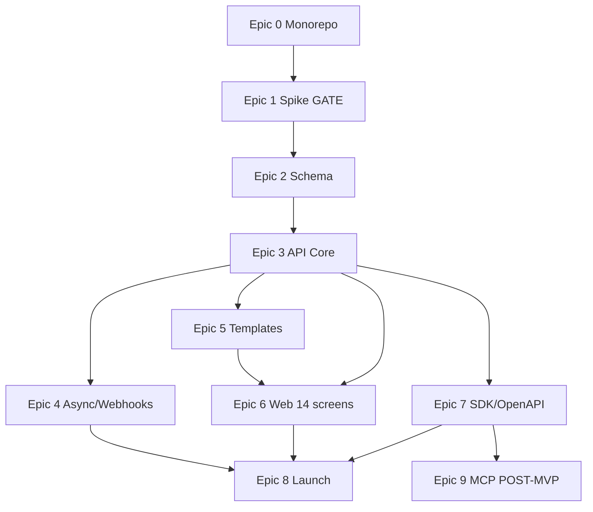

---
stepsCompleted:
  - step-01-document-discovery
  - step-02-prd-analysis
  - step-03-epic-coverage-validation
  - step-04-ux-alignment
  - step-05-epic-quality-review
  - step-06-final-assessment
date: 2026-07-20
project: usetagih
assessor: implementation-readiness (headless)
verdict: READY WITH CONDITIONS
trueStoryCount: 83
documentsAssessed:
  - _bmad-output/planning-artifacts/prds/prd-usetagih-2026-07-20/prd.md
  - _bmad-output/planning-artifacts/prds/prd-usetagih-2026-07-20/addendum.md
  - _bmad-output/planning-artifacts/ux-designs/ux-usetagih-2026-07-20/DESIGN.md
  - _bmad-output/planning-artifacts/ux-designs/ux-usetagih-2026-07-20/EXPERIENCE.md
  - _bmad-output/planning-artifacts/architecture/architecture-usetagih-2026-07-20/ARCHITECTURE-SPINE.md
  - _bmad-output/planning-artifacts/architecture/architecture-usetagih-2026-07-20/SOLUTION-DESIGN.md
  - _bmad-output/planning-artifacts/epics.md
---

# Implementation Readiness Assessment Report

**Date:** 2026-07-20  
**Project:** usetagih  
**Gate:** Phase 3 (final) — headless assessment for King  
**Verdict:** **READY WITH CONDITIONS**

---

## Document Discovery

### PRD

| File | Role |
|------|------|
| `prds/prd-usetagih-2026-07-20/prd.md` | Authoritative PRD; §10 = frozen contract v1 |
| `prds/prd-usetagih-2026-07-20/addendum.md` | Pricing hypothesis, handoff notes |

No duplicate whole/sharded PRD conflict. Single authoritative pair.

### Architecture

| File | Role |
|------|------|
| `architecture/architecture-usetagih-2026-07-20/ARCHITECTURE-SPINE.md` | AD-1–AD-12, stack, structural seed (gate-3 hardened) |
| `architecture/architecture-usetagih-2026-07-20/SOLUTION-DESIGN.md` | Render pipeline, spike gate, DB, deploy detail (gate-3 hardened) |

Supporting review/memlog files exist under `architecture/.../reviews/` and `.memlog.md` but are **not** authoritative gate artifacts; some still mention Typst 0.13.x historically (see Findings).

### UX

| File | Role |
|------|------|
| `ux-designs/ux-usetagih-2026-07-20/DESIGN.md` | Visual tokens, Mantine brand layer |
| `ux-designs/ux-usetagih-2026-07-20/EXPERIENCE.md` | 14-screen spine, routes, API action map |

No duplicate UX versions.

### Epics & Stories

| File | Role |
|------|------|
| `epics.md` | 10 epics, 83 stories, FR/NFR/AD/UX-DR inventory, coverage map |

No sharded epics folder. `epic-0-loop-verify.md` is auxiliary verification, not a competing epic source.

### Missing / Duplicates

- **Duplicates:** None blocking assessment.
- **Missing:** None of the required artifact types.

---

## PRD Analysis

### Functional Requirements (FR-1 – FR-35)

| Range | Count | Notes |
|-------|-------|-------|
| FR-1 – FR-32 | 32 | MVP scope |
| FR-33 – FR-35 | 3 | v1.1 MCP; explicitly POST-MVP in PRD §4.10 |

All FRs extracted in `epics.md` Requirements Inventory match PRD §4 numbering and intent.

### Non-Functional Requirements (NFR-1 – NFR-12)

Twelve NFRs in PRD §8; all present in epics inventory with architecture bindings (AD-3, AD-10, AD-11, etc.).

### Additional Requirements

PRD §9 constraints (stack, architecture shape, marketing guardrails, privacy) reflected in Epic 0, Epic 8, and AD entries. Addendum pricing hypothesis aligned with PRD §11 OQ-5.

### PRD Completeness

PRD is **final** with board-ratified contract v1 in §10. Assumptions index and resolved decisions (§11) close former open questions (share TTL, watermark, sync/async, webhooks, pricing structure).

---

## Epic Coverage Validation

### Coverage Statistics

| Metric | Value |
|--------|-------|
| Total PRD FRs (MVP) | 32 (FR-1 – FR-32) |
| FRs mapped in epics | 32 |
| MVP coverage | 100% |
| POST-MVP FRs (FR-33 – FR-35) | Epic 9 only; fenced |

### FR Coverage Matrix (summary)

Every MVP FR maps to ≥1 epic per `epics.md` FR Coverage Map. Representative checks:

| FR | Epic(s) | Status |
|----|---------|--------|
| FR-1 discriminated union | Epic 2 | ✓ |
| FR-12 sync/async render | Epic 3 (sync), Epic 4 (async) | ✓ |
| FR-17 402/429 | Epic 3 Story 3.15 | ✓ |
| FR-24 idempotency | Epic 3 Story 3.7 | ✓ |
| FR-25–26 webhooks | Epic 4 | ✓ |
| FR-28–30 web UI | Epic 6 | ✓ |
| FR-31–32 SDK | Epic 7 | ✓ |

**Missing FR coverage:** None for MVP.

---

## Contract v1 Cross-Artifact Consistency (Hard Verification)

Verified across PRD §10, ARCHITECTURE-SPINE, SOLUTION-DESIGN, and epics stories.

| Contract element | PRD §10 | Architecture | Epics | Status |
|------------------|---------|--------------|-------|--------|
| Sync render `201` (≤100 items, ≤10s) | ✓ | AD-4 | Stories 3.11, 1.x | **ALIGNED** |
| Async `202` (>100, timeout, `Prefer: respond-async`) | ✓ | AD-4 | Stories 4.2 | **ALIGNED** |
| `402 QUOTA_EXCEEDED` vs `429 RATE_LIMITED` | ✓ one code → one status | AD-11 | Story 3.15 | **ALIGNED** |
| `400 DOCUMENT_TYPE_MISMATCH` | ✓ | AD-1 | Stories 2.1, 3.8 | **ALIGNED** |
| Scopes `renders:read/write`, `webhooks:manage`, `audit:read` | ✓ | AD-7 | Stories 3.4, 3.5, 6.9 | **ALIGNED** |
| `shareTtlDays` 1–365, default 90 | ✓ | AD-6 | Stories 3.13 | **ALIGNED** |
| Idempotency key 1–255 printable ASCII | ✓ | AD-5 | Stories 3.7, 7.2 | **ALIGNED** |
| Discriminated union per document type | ✓ | AD-1 | Story 2.1 | **ALIGNED** |
| Branding settings-default + payload override | ✓ §10.1 | SOLUTION §4.1 step 4 | Stories 3.16, 3.9 | **ALIGNED** |
| Typst **0.15.x** (no 0.13 in gate docs) | — | AD-3, Stack table | Stories 1.1+ | **ALIGNED** |
| Webhook 8 attempts ~24h + auto-disable 7d | ✓ FR-26, §11 | AD-8 | Stories 4.4, 4.5 | **ALIGNED** |
| Watermark footer only (no diagonal); Pro omits | ✓ FR-7, §11 OQ-2 | SOLUTION §4.3 | Stories 1.2, 3.11, 5.x | **ALIGNED** |

**Note:** Historical references to Typst 0.13.x remain in `architecture/.../.memlog.md` and `reviews/review-version-check.md` only. Gate-3 authoritative docs (SPINE + SOLUTION-DESIGN) correctly pin 0.15.x.

---

## UX Alignment Assessment

### UX Document Status

**Found** — `DESIGN.md` + `EXPERIENCE.md` (final).

### 14-Screen → Story Mapping

| Screen ID | Route(s) | Epic 6 Story |
|-----------|----------|--------------|
| SCR-LANDING | `/` | 6.3 |
| SCR-AUTH-SIGNIN | `/sign-in` | 6.2 |
| SCR-AUTH-SIGNUP | `/sign-up` | 6.2 |
| SCR-AUTH-RESET* | `/forgot-password`, `/reset-password` | 6.2 |
| SCR-DASHBOARD | `/app` | 6.4 (+ AppShell) |
| SCR-DOC-CREATE | `/app/documents/new` | 6.5 |
| SCR-DOC-HISTORY | `/app/documents` | 6.7 |
| SCR-DOC-DETAIL | `/app/documents/:renderId` | 6.7 |
| SCR-TEMPLATE-GALLERY | `/app/templates` | 6.8 |
| SCR-API-KEYS | `/app/api-keys` | 6.9 |
| SCR-AUDIT-LOG | `/app/audit` | 6.10 |
| SCR-SETTINGS | `/app/settings` | 6.11 |
| SCR-SHARE-PUBLIC | `/share/:token` | 6.12 |

**Coverage:** 14/14 screen IDs mapped. Playwright UJ-1 (6.6) and a11y (6.13) cross-cut create/auth flows.

### UX ↔ Architecture ↔ PRD

- Thin API consumer constraint: aligned (AD-2, EXPERIENCE §Foundation).
- Preview same Typst engine (SVG): aligned (AD-3, SOLUTION §4.2, Story 1.7, 3.10).
- Webhooks API-only (no UI): aligned across all artifacts.
- Stale UX copy issues documented in Findings (non-blocking for epics-led implementation).

---

## Epic Quality Review

### Epic Structure

| Check | Result |
|-------|--------|
| User-value epics (not pure infra milestones) | PASS — Epic 0 is substrate; Epic 1 is explicit board gate with exit protocol |
| Epic independence (no Epic N requires N+1) | PASS — dependency DAG acyclic |
| Spike gate respected (Epic 1 blocks 2–8) | PASS |
| MCP confined to Epic 9 + stub Story 0.1 | PASS |
| No payments/orgs/marketplace/i18n/e-invoicing stories | PASS |
| CONTRIBUTING.md gates template parallel work (5.0 → 5.1–5.5) | PASS |
| POST /v1/session/token + scope-parity matrix | PASS (Story 3.4) |

### Epic Dependency Graph (acyclic)

No cycles. Epic 1 failure halts Epics 2–8 per AD-10.

### Story Quality

| Check | Result |
|-------|--------|
| All 83 stories have Given/When/Then ACs | PASS |
| Test expectations (bun test, integration, Playwright, golden CI) | PASS |
| Contract specifics in API/render stories | PASS |
| Forward dependencies within epics | PASS — ordered (e.g., 5.0 before 5.1) |
| FR/NFR/AD traceability | PASS — no orphan AD-13+ or FR-36+ references found |

### Story Count Reconciliation

| Source | Claimed count | Verified |
|--------|---------------|----------|
| `### Story` headers in `epics.md` | — | **83** (enumerated) |
| Epic breakdown footer in `epics.md` | 83 | **83** (0:6 + 1:9 + 2:6 + 3:17 + 4:7 + 5:6 + 6:13 + 7:6 + 8:8 + 9:5) |
| "88" headline | Not present in current `_bmad-output` | **N/A — likely superseded draft** |

**True story count: 83** (MVP sprint: 78 stories in Epics 0–8; Epic 9 adds 5 POST-MVP backlog stories).

---

## Findings (Full List)

| ID | Severity | Category | Location | Description | Fix |
|----|----------|----------|----------|-------------|-----|
| F-01 | **MINOR** | UX staleness | `EXPERIENCE.md` §API key create flow (~L163), Flow 2 (~L579) | Scope names `documents:read`, `documents:write`, `render:write` conflict with PRD §10.2 `renders:read`, `renders:write` | Replace with canonical scope enum; Story 6.9 AC already mandates this — update EXPERIENCE for single source of truth |
| F-02 | **MINOR** | UX staleness | `EXPERIENCE.md` Render success panel (~L147), sequence diagram (~L572) | Uses response field `pdfUrl`; contract v1 field is `shareUrl` | Rename to `shareUrl` throughout EXPERIENCE |
| F-03 | **MINOR** | UX staleness | `EXPERIENCE.md` Open Items (~L625) | Free-tier watermark marked `[ASSUMPTION] Pending product confirmation` | Mark resolved per PRD §11 OQ-2 (footer line only, no diagonal watermark) |
| F-04 | **MINOR** | UX ↔ contract | `EXPERIENCE.md` Downstream Architecture Notes (~L636) | States web sends "branding profile ID"; PRD §10.1 + Story 3.16 use account settings merge + optional payload `branding` override | Revise note: web PATCHes settings; create flow may omit branding on payload; server merges defaults |
| F-05 | **INFO** | Historical artifact | `architecture/.../.memlog.md`, `reviews/review-version-check.md` | Typst 0.13.x references pre gate-3 re-pin | Optional cleanup; gate docs already at 0.15.x |
| F-06 | **INFO** | Count reconciliation | External "88" claim | No "88" in current planning artifacts; verified **83** stories | Use 83 in all downstream tooling |

**Blocking findings:** 0  
**Minor findings:** 4 (F-01 – F-04)  
**Informational:** 2 (F-05 – F-06)

---

## Scope Leakage Audit

| Forbidden scope | Stories touching? | Verdict |
|-----------------|-------------------|---------|
| Payments / Stripe | No implementation stories | PASS |
| Multi-tenant orgs | Explicitly excluded | PASS |
| Template marketplace | Gallery is curated browse only | PASS |
| i18n / non-English | English-only in FR-5 stories | PASS |
| E-invoicing / PEPPOL / e-Faktur | Guardrail copy only | PASS |
| MCP beyond Epic 9 | Stub in 0.1; Epic 9 fenced POST-MVP | PASS |

Story 5.3 persona "marketplace integrator" is UJ-4 receipt context, not marketplace product scope.

---

## Summary and Recommendations

### Overall Readiness Status

**READY WITH CONDITIONS**

Planning artifacts are sufficiently aligned for Phase 4 agent implementation. Contract v1 specifics are consistent across PRD §10, gate-3 architecture, and epics. All MVP FRs are covered; the epic dependency graph is acyclic and respects the Epic 1 spike gate; all 14 UX screens map to Epic 6 stories.

Conditions are limited to **UX EXPERIENCE.md staleness** (F-01 – F-04). Epics stories already encode correct contract behavior, so implementation can proceed while UX doc is patched in parallel.

### Apply Before / During Epic 6 (recommended)

1. Patch `EXPERIENCE.md` scope names to `renders:read`, `renders:write`, `webhooks:manage`, `audit:read`.
2. Replace `pdfUrl` → `shareUrl` in EXPERIENCE render success and diagrams.
3. Close watermark Open Item as resolved (footer bar, Embed Pro+ white-label).
4. Fix branding downstream note to match settings merge + payload override model.

### Recommended Next Steps

1. **Proceed to Epic 0** — monorepo/CI foundation (no blockers).
2. **Treat Epic 1 as hard gate** — do not merge Epics 2–8 until SPIKE-RESULT.md = PASS in CI Docker.
3. **Use `epics.md` as implementation authority** where EXPERIENCE.md conflicts with contract v1.
4. **Optional:** Archive or annotate architecture review files that still cite Typst 0.13.x to avoid agent confusion.

### Final Note

This assessment identified **6 findings** (4 minor, 2 informational) across UX staleness and documentation hygiene. **Zero blocking misalignments** on contract v1, FR coverage, epic structure, or scope fences. Phase 4 implementation may start under the conditions above.

---

**Assessor:** BMad implementation-readiness workflow (headless)  
**Report path:** `_bmad-output/planning-artifacts/implementation-readiness-report-2026-07-20.md`
