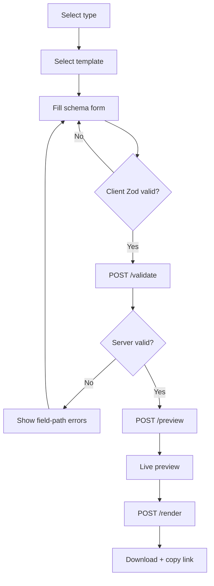
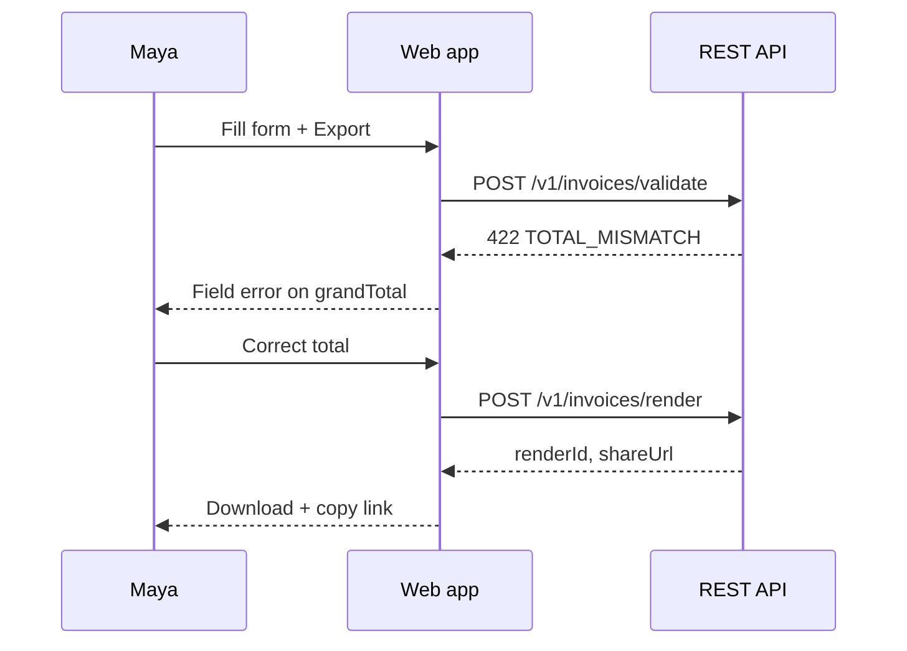

# usetagih — Experience Spine

> Mantine v8 responsive web app consuming the public REST API only. Paired with `DESIGN.md`. Positioning: *Strict schema in. Branded PDF out. No ledger.*

## Foundation

**Form factor:** Responsive web (desktop-primary, mobile-capable for history/share/auth).

**UI system:** Mantine v8 (`@mantine/core`, `@mantine/hooks`, `@mantine/form`, `@mantine/notifications`, `@mantine/dropzone` for logo). Data tables via `mantine-datatable`. Icons via `@tabler/icons-react`. Tailwind available for utility spacing only — Mantine is the component system of record.

**Architecture constraint:** The web app is a **thin API consumer**. Every screen action maps to a public REST endpoint (PRD §10). No privileged server routes, no client-side-only validation that bypasses server checks. Client-side Zod parsing mirrors the canonical contract for instant feedback; server responses are authoritative.

**Auth:** better-auth session for web UI. API keys managed via same REST API integrators use. GitHub OAuth + email/password.

**Product boundary:** Render-only document layer. Screens must never imply accounting (no ledger, payment status, reminders, client CRM, "sent" workflows). Nav vocabulary uses *Documents*, *Renders*, *Templates*, *API*, *Audit* — not *Invoices due*, *Clients*, *Payments*.

**Schema-driven forms:** The same Zod `DocumentPayload` contract (PRD §10.1) drives form shape, client validation, and displayed server errors. Financial values are never silently corrected in the UI.

→ Visual identity reference: `DESIGN.md`. Spine wins on conflict with any mock or wireframe.

## Information Architecture

### Route map

| Route | Auth | Screen ID | Purpose |
|---|---|---|---|
| `/` | Public | `SCR-LANDING` | Marketing-lite entry, CTA to sign up / sign in |
| `/sign-in` | Public | `SCR-AUTH-SIGNIN` | Email/password + GitHub OAuth login |
| `/sign-up` | Public | `SCR-AUTH-SIGNUP` | Registration |
| `/forgot-password` | Public | `SCR-AUTH-RESET` | Password reset request |
| `/reset-password` | Public | `SCR-AUTH-RESET-CONFIRM` | New password entry (token from email) |
| `/app` | Session | `SCR-DASHBOARD` | Authenticated home — quick actions + recent renders |
| `/app/documents/new` | Session | `SCR-DOC-CREATE` | Document creation wizard (Stepper) |
| `/app/documents` | Session | `SCR-DOC-HISTORY` | Paginated render history |
| `/app/documents/:renderId` | Session | `SCR-DOC-DETAIL` | Single render metadata + re-download / re-copy link |
| `/app/templates` | Session | `SCR-TEMPLATE-GALLERY` | Browse 3 types × 2 styles |
| `/app/api-keys` | Session | `SCR-API-KEYS` | Create, scope, revoke keys |
| `/app/audit` | Session | `SCR-AUDIT-LOG` | Paginated audit events (90 days) |
| `/app/settings` | Session | `SCR-SETTINGS` | Branding + business identity |
| `/share/:token` | Public | `SCR-SHARE-PUBLIC` | No-auth document view + download (viral loop) |

**Webhooks:** API-only at MVP — no webhook management UI (embed integrators configure via REST).

### App shell (authenticated)

```
AppShell
├── Navbar (NavLink items)
│   ├── Dashboard          → /app
│   ├── New document       → /app/documents/new
│   ├── Documents          → /app/documents
│   ├── Templates          → /app/templates
│   ├── API keys           → /app/api-keys
│   ├── Audit log          → /app/audit
│   └── Settings           → /app/settings
├── Header
│   ├── Breadcrumbs (contextual)
│   ├── Quota indicator (Badge, optional)
│   └── Menu (Avatar) → Sign out
└── Main (Container or full-bleed for create flow)
```

**Responsive:** `AppShell.Navbar` persistent at `md+` (≥768px). Below `md`, navbar collapses to `AppShell.Navbar` with `collapsed: { mobile: true }` and hamburger `Burger` in header opens `Drawer` with same `NavLink` set.

### IA closure matrix

| PRD need | Surface | Journey |
|---|---|---|
| FR-28 document form | `SCR-DOC-CREATE` | UJ-1 |
| FR-29 preview/export | `SCR-DOC-CREATE` step 4 | UJ-1 |
| FR-30 render history | `SCR-DOC-HISTORY`, `SCR-DOC-DETAIL` | UJ-1 |
| FR-21 auth | `SCR-AUTH-*` | UJ-1 |
| FR-22/23 API keys | `SCR-API-KEYS` | UJ-2, UJ-5 |
| FR-27 audit | `SCR-AUDIT-LOG` | UJ-2 |
| FR-18/19 share links | `SCR-SHARE-PUBLIC`, success on create | UJ-1, UJ-4 |
| Template quality | `SCR-TEMPLATE-GALLERY`, create step 2 | UJ-1 |
| Branding in PDFs | `SCR-SETTINGS` | UJ-1 |

## Voice and Tone

Microcopy follows infrastructure clarity — precise, calm, no hustle culture.

| Do | Don't |
|---|---|
| "Payload failed validation" | "Oops! Something went wrong" |
| "grandTotal does not match computed 1089.00" | "Please check your total" |
| "Render complete" | "Your invoice is ready! 🎉" |
| "Copy share link" | "Send to client" |
| "Document history" | "Your invoices" |
| "Render layer only — not accounting software" (footer/help) | "Manage your business finances" |

Error messages display server `details[].path`, `message`, and when present `expected` / `received` — never paraphrase away financial precision.

## Component Patterns

Behavioral specs. Visual tokens in `DESIGN.md`.

### Schema-driven form engine

| Pattern | Mantine components | Rules |
|---|---|---|
| Section form | `Fieldset`, `Legend`, `Stack`, `Grid` | One fieldset per contract section: metadata, seller, buyer, lineItems, taxLines, totals, notes |
| Field binding | `TextInput`, `NumberInput`, `Textarea`, `Select` | `name` maps to JSON Pointer path (e.g. `seller.name`, `lineItems.0.quantity`) |
| Money fields | `TextInput` with `inputMode="decimal"` | Store/display as decimal strings per `Money.amount`; no float coercion |
| Line items | `Table`, `ActionIcon`, `Button` | Min 1 row; add via `IconPlus`, remove via `IconTrash` (disabled when 1 row) |
| Inline validation | `useForm` + shared Zod schema | Validate on blur and on submit; debounced 300ms for totals cross-check |
| Server errors | `Alert` + per-field `error` prop | Map `details[].path` → field; unmapped paths → summary `Alert` |
| Path display | `Text` + `Code` | Show JSON path next to field label on server error |

### Document creation wizard

| Step | Label | Content |
|---|---|---|
| 0 | Type | 3 `Card` tiles: Invoice, Quotation, Receipt |
| 1 | Template | 2 `Card` thumbnails per type from `GET /v1/schemas` |
| 2 | Details | Schema form (split pane on `lg+`) |
| 3 | Preview & export | Preview pane + actions |

`Stepper` allows backward navigation; form state persists in React state + optional `sessionStorage` draft key `usetagih:draft:{userId}`.

### Preview pane

| State | Treatment |
|---|---|
| Idle | Placeholder `Text`: "Fill in details to preview" |
| Validating | `Loader` + "Validating…" |
| Valid preview | `ScrollArea` with `dangerouslySetInnerHTML` or sandboxed `iframe` from `POST /v1/{type}/preview` response |
| Invalid | Preview hidden; validation errors shown in form |

Preview refresh: debounced 500ms after last valid field change, or manual `Button` "Refresh preview".

### Render success panel

On `POST /v1/{type}/render` success:

- `Alert` `color="green"`: "Render complete"
- `Button` `{components.button-render}`: Download PDF → `GET /v1/renders/{renderId}/download`
- `CopyButton` + `TextInput` readOnly: share URL from response `shareUrl`
- `Anchor`: View in history → `/app/documents/{renderId}`

### Data tables

Use `mantine-datatable` `DataTable` for:

- **Documents history:** columns — date, document number, type (`Badge`), template, status, actions (download, copy link)
- **Audit log:** timestamp, action, resource, outcome, IP (API events)
- **API keys:** name, prefix, scopes (`Badge` group), created, last used, status, revoke action

Server-side pagination: `page`/`pageSize` query params matching API defaults (20, max 100).

### API key create flow

1. `Button` "Create key" opens `Modal`
2. Form: `TextInput` name, `Checkbox.Group` scopes (`renders:read`, `renders:write`, `webhooks:manage`, `audit:read`), optional `DateInput` expiry
3. Submit → `POST /v1/api-keys` (endpoint per architecture; scopes per FR-22)
4. Success modal replaces content: show-once `Code` block with full secret, `CopyButton`, `Alert` "This secret won't be shown again"
5. Close → list refreshes

### Settings / branding

Sections in `Tabs`:

| Tab | Fields | API |
|---|---|---|
| Business identity | name, email, address block, tax ID | `PATCH /v1/settings/business` |
| Branding | logo (`Dropzone`), accent color (`ColorInput`) | `PATCH /v1/settings/branding` + logo upload endpoint |
| Account | email (read-only), change password link | better-auth |

Branding applies to rendered PDF templates, not app chrome (app uses `DESIGN.md` tokens).

## State Patterns

| State | Surface | Mantine treatment |
|---|---|---|
| Loading (initial) | All data surfaces | `Skeleton` rows/cards matching layout |
| Empty history | `SCR-DOC-HISTORY` | `Stack` center: `IconFileOff`, "No renders yet", `Button` → new document |
| Empty audit | `SCR-AUDIT-LOG` | "No activity recorded yet" |
| Empty API keys | `SCR-API-KEYS` | "No API keys" + create CTA + link to docs |
| Validation blocked | `SCR-DOC-CREATE` | Fields `error` + summary `Alert` `color="red"`; export buttons `disabled` |
| Render processing | `SCR-DOC-CREATE` | `Button` loading; if `202` response, `Loader` + poll `GET /v1/renders/{renderId}` every 2s |
| Render failed | `SCR-DOC-CREATE` | `Alert` with error code + `Button` retry |
| Expired share link | `SCR-SHARE-PUBLIC` | Full-page `Paper`: "This link has expired" + sign-up CTA |
| Expired link (auth detail) | `SCR-DOC-DETAIL` | `Badge color="orange"` + "Re-render to generate a new link" |
| Quota exceeded | Any render action | `Alert` from `402`/`429` + upgrade guidance copy |
| Rate limited | API-backed actions | `notifications.show` with `Retry-After` countdown |
| Session expired | Any `/app/*` | Redirect to `/sign-in?redirect={path}` |
| 404 render | `SCR-DOC-DETAIL` | "Render not found" + back to history |
| Logo upload fail | `SCR-SETTINGS` | `Alert` + retain previous logo |
| Offline | Global | `Affix` bottom `Alert` "You're offline" — form edits local only, API calls queued not required at MVP |

## Interaction Primitives

**Primary actions**

- `Enter` in single-line fields → next field (form) or submit (auth)
- `Cmd/Ctrl+Enter` in document form → trigger preview refresh
- `Escape` → close topmost `Modal`

**Keyboard / focus**

- `Stepper` steps focusable; arrow keys navigate steps when focused
- Line item table: Tab through cells row-major
- `CopyButton` announces via `notifications.show`

**Banned**

- Silent auto-recalculation of totals that overwrites user-entered `grandTotal`
- "Mark as paid", "Send reminder", "Record payment" actions
- Client-side-only export without server validation pass
- Webhook UI at MVP
- Multi-tenant org switcher

## Accessibility Floor

Target WCAG 2.1 AA (NFR-9).

- All form fields: explicit `<label>` via Mantine `label` prop; `aria-describedby` links to error text
- Validation errors: `role="alert"` on field error text; summary `Alert` uses `aria-live="polite"`
- `Stepper`: `aria-current="step"` on active step
- Preview iframe: `title="Document preview"`
- `DataTable`: sortable headers are `button` with `aria-sort`
- Color contrast: `{colors.primary}` and `{colors.accent}` on white verified ≥4.5:1 for text/buttons
- Focus visible: Mantine default focus ring, never removed
- Share page: download `Button` is primary focus target; metadata readable without preview
- GitHub OAuth `Button`: accessible name "Sign in with GitHub"
- Reduced motion: respect `prefers-reduced-motion`; disable preview refresh animations

## Responsive & Platform

| Breakpoint | Behavior |
|---|---|
| `≥ lg` (992px) | Document create: 50/50 split — form left, preview right sticky |
| `md` (768–991px) | Form full width; preview below fold in `Tabs` ("Form" / "Preview") |
| `< md` | `Drawer` nav; creation wizard one column; preview in Step 3 tab |
| `< sm` (576px) | Line items: card-per-row layout instead of `Table` |
| Share page | Single column, max-width 480px centered |

Desktop-primary aligns with UJ-1 (Maya at laptop) and embed integrators testing in browser.

## Inspiration & Anti-patterns

**Lifted from**

- **Stripe Dashboard:** API keys show-once pattern, audit log density, infrastructure tone
- **Invovate (competitor):** template thumbnail selection — but with stricter validation UX
- **Mantine docs:** form patterns, `AppShell` layout, `notifications` for async feedback

**Rejected**

- Invoice Ninja / FreshBooks client-centric nav
- "Send invoice" email flows
- Payment status badges (Paid / Unpaid / Overdue)
- Drag-and-drop template editor
- Visual JSON editor as primary input (form-first; JSON import deferred post-MVP)
- Diagonal free-tier watermark (resolved: single footer line per PRD OQ-2)

## API Action Map

Every screen action → endpoint. Session auth uses cookie; API keys page uses session to manage keys.

| UI action | Method | Endpoint |
|---|---|---|
| Load schemas/templates | GET | `/v1/schemas` |
| Validate form | POST | `/v1/{documentType}/validate` |
| Preview | POST | `/v1/{documentType}/preview` |
| Render / export | POST | `/v1/{documentType}/render` |
| Poll render status | GET | `/v1/renders/{renderId}` |
| Download PDF | GET | `/v1/renders/{renderId}/download` |
| List history | GET | `/v1/renders?page&pageSize&documentType&from&to` |
| List audit | GET | `/v1/audit?page&pageSize` |
| Create API key | POST | `/v1/api-keys` |
| Revoke API key | DELETE | `/v1/api-keys/{keyId}` |
| Update settings | PATCH | `/v1/settings/business`, `/v1/settings/branding` |
| Upload logo | POST | `/v1/settings/branding/logo` |
| Resolve share link | GET | `/v1/share/{token}` (public metadata + download redirect) |
| Sign in/up/out | — | better-auth routes (`/api/auth/*`) |

Error envelope (PRD §10.3): all errors render `error.message` + expandable `details` list with `Code` paths.

## Per-Screen Specification

### SCR-LANDING — Landing

**Purpose:** Marketing-lite entry; communicate positioning; drive sign-up.

**Layout:** Full-width, no `AppShell`. `Container size="lg"`.

**Components:**

- `Header` minimal: logo wordmark + `Group`: `Anchor` Sign in, `Button` Get started
- Hero `Stack`: `{typography.display}` headline "Strict schema in. Branded PDF out.", subhead, `Group` CTAs
- `SimpleGrid` cols={3}: feature cards (Validate, Render, Share) — `ThemeIcon` + `Text`
- `Paper` code snippet: example `POST /v1/invoices/render` with `Code` block
- `SimpleGrid` template teasers (static thumbnails, 3×2)
- Footer: "Render layer only — not accounting or e-invoicing clearance", links to docs/GitHub

**States:** Static (no loading). 

**API:** None.

---

### SCR-AUTH-SIGNIN / SCR-AUTH-SIGNUP / SCR-AUTH-RESET*

**Purpose:** better-auth flows.

**Layout:** Centered `Paper` `w={420}` on `{colors.surface-base}`.

**Components:**

- `TextInput` email, `PasswordInput`
- `Button` fullWidth submit
- `Divider` label="or"
- `Button` leftSection=`IconBrandGithub` variant default — GitHub OAuth
- `Anchor` toggles sign-in ↔ sign-up; forgot password link
- Sign-up: password strength `Progress` (better-auth policy)

**States:** Loading on submit (`Button loading`); error `Alert` from auth failure.

**API:** better-auth only.

---

### SCR-DASHBOARD — Dashboard

**Purpose:** Authenticated landing; quick actions + recent renders.

**Components:**

- `Title` Welcome back
- `SimpleGrid` 3 `Card`s: New invoice, New quotation, New receipt → `/app/documents/new?type=`
- `Title order={3}` Recent documents
- `DataTable` last 5 renders (mini history) or `Skeleton`
- `Anchor` View all → history

**States:** Loading skeleton; empty recent → "Create your first document"

**API:** `GET /v1/renders?pageSize=5`

---

### SCR-DOC-CREATE — Document creation wizard

**Purpose:** UJ-1 core flow — type → template → form → preview → export.

**Layout:** Full-bleed below header. `Stepper` horizontal top. Content area below.

#### Step 0 — Type

- `SimpleGrid cols={{ base: 1, sm: 3 }}`
- 3× `Card` `withBorder` selectable: `IconFileInvoice`, `IconFileText`, `IconReceipt` + label + one-line description
- Selected: `{components.document-type-card.hover-border}`
- `Button` Continue (disabled until selection)

#### Step 1 — Template

- Fetch templates from `GET /v1/schemas` for selected type
- 2× `Card` with thumbnail image, template name (`modern` / `classic`), `Badge` if default
- `Button` Back / Continue

#### Step 2 — Details (schema form)

**Desktop (`lg+`):** `Grid` 2 columns

- Left `ScrollArea` h="calc(100vh - 200px)": form fieldsets
- Right sticky: preview pane (see Preview pane pattern)

**Mobile:** `Tabs` default "Form"

**Form sections (Fieldsets):**

1. **Document** — `documentNumber`, `issuedAt` (`DateInput`), `dueAt` (optional, hidden for receipt), `currency` (`Select` ISO 4217)
2. **Seller** — party fields
3. **Buyer** — party fields
4. **Line items** — editable table
5. **Tax & discount** — optional `taxLines`, `discount`
6. **Totals** — `subtotal`, `taxTotal`, `grandTotal` (Money inputs; not auto-overwritten)
7. **Notes** — optional `Textarea`

**Footer actions:** `Button` Validate (`POST validate`), `Button` variant light Preview refresh

#### Step 3 — Preview & export

- Full-width preview `ScrollArea`
- Validation status `Badge`: Valid / Invalid
- `Group`: `Button` `{components.button-render}` Export PDF, `Button` variant outline Download (disabled until render), `CopyButton` share link (disabled until render)
- `Button` Back to edit

**States:** See State Patterns. Idempotency: web UI generates `uuid` v4 `Idempotency-Key` per export attempt stored in session.

**API:** validate, preview, render, download.



---

### SCR-DOC-HISTORY — Documents history

**Purpose:** FR-30 — list past renders.

**Components:**

- `Group` justify space-between: `Title` Documents, `Button` New document
- Filters: `Select` document type, `DatePickerInput` range
- `DataTable` paginated
- Row actions: `ActionIcon` download, `ActionIcon` copy link, `Anchor` detail

**States:** Empty, loading skeleton, error `Alert`, data

**API:** `GET /v1/renders`

---

### SCR-DOC-DETAIL — Render detail

**Purpose:** Single render metadata + actions.

**Components:**

- `Breadcrumbs`
- `Paper`: renderId (`Code`), type, template, schema version, status, timestamps
- `Badge` link status (active / expired)
- `Group` actions: Download, Copy link, New render from same payload (future — MVP: link to create with note "duplicate not supported")
- If expired: `Alert color="orange"`

**API:** `GET /v1/renders/{renderId}`

---

### SCR-TEMPLATE-GALLERY — Template gallery

**Purpose:** Browse 6 curated templates (3 types × 2 styles).

**Components:**

- `Title` Templates
- `Text` curation note: "Templates are selected at render time — not editable at MVP"
- `Tabs` Invoice | Quotation | Receipt
- Per tab: `SimpleGrid cols={2}` template cards with full thumbnail, name, description
- `Button` Use template → `/app/documents/new?type=&template=`

**States:** Static from `GET /v1/schemas`; loading skeleton

**API:** `GET /v1/schemas`

---

### SCR-API-KEYS — API keys

**Purpose:** FR-22, FR-23.

**Components:**

- `Title` + docs `Anchor`
- `Button` Create key
- `DataTable`: name, prefix, scopes, created, last used, status, revoke
- Revoke: `Modal` confirm → `DELETE`

**Create modal:** see API key create flow.

**API:** `GET/POST/DELETE /v1/api-keys`

---

### SCR-AUDIT-LOG — Audit log

**Purpose:** FR-27 — embed trust.

**Components:**

- `Title` Audit log
- `Text` "Last 90 days. Append-only."
- Filters: `Select` action type, `TextInput` resource id
- `DataTable`: timestamp, action, actor, resource, outcome, IP
- Export CSV deferred post-MVP

**API:** `GET /v1/audit`

---

### SCR-SETTINGS — Settings

**Purpose:** Branding + business identity for PDF output.

**Components:** `Tabs` Business | Branding | Account

- Business: form fields matching `Party` + extended address
- Branding: `Dropzone` logo (PNG/SVG, max 2MB), `ColorInput` accent, live `Paper` mini preview swatch
- Account: better-auth password change

**API:** settings endpoints + logo upload

---

### SCR-SHARE-PUBLIC — Public share page

**Purpose:** Viral loop — recipient views/downloads without account.

**Layout:** No app chrome. Centered `Container size="sm"`.

**Components:**

- Logo wordmark small
- `Paper`: document type label, document number, issued date, seller name
- PDF embed `iframe` or thumbnail preview (first page image from API)
- `Button` size="lg" Download PDF
- Footer: "Powered by usetagih" `Anchor` → landing; subtext "Render layer — not a payment request"

**States:**

- Valid: preview + download
- Expired: `IconClockOff`, expiry message, CTA create free account
- Invalid token: 404 message

**API:** `GET /v1/share/{token}`

**Guardrail:** No login required; no edit; no payment CTA.

## Key Flows

### Flow 1 — Maya creates and exports an invoice (UJ-1)

**Protagonist:** Maya, solo freelance designer, Bandung.

1. Maya lands on `SCR-LANDING`, clicks **Get started**.
2. `SCR-AUTH-SIGNUP`: email + password → session → redirect `/app`.
3. `SCR-DASHBOARD`: clicks **New invoice** → `SCR-DOC-CREATE?type=invoice`.
4. Step 0: Invoice pre-selected; Continue.
5. Step 1: selects **modern** template thumbnail; Continue.
6. Step 2: fills seller (her business), buyer (client), 2 line items, totals. On blur, client Zod flags quantity × unitPrice ≠ lineTotal — she fixes before continuing.
7. Clicks **Validate** → `POST /v1/invoices/validate` returns 200. Preview pane loads via `POST /v1/invoices/preview`.
8. Step 3: reviews preview — pagination, currency formatting correct.
9. **Climax:** Clicks **Export PDF** → `POST /v1/invoices/render` → success panel → PDF downloads → share link copied. She opens share URL in incognito — `SCR-SHARE-PUBLIC` shows same document.
10. **Resolution:** Render appears in `SCR-DOC-HISTORY`; she re-downloads next week from detail.

**Edge — total mismatch:** Maya enters `grandTotal` 1100 but computed is 1089. Server returns `422` with path `/totals/grandTotal`, expected/received. Field highlights red; export disabled. No silent fix.



### Flow 2 — Alex verifies API key UX (UJ-2 web parallel)

1. Alex signs in, navigates to `SCR-API-KEYS`.
2. Creates key with scopes `renders:write`, `renders:read`.
3. Show-once secret copied; modal closed.
4. Checks `SCR-AUDIT-LOG`: "api_key.created" event present.
5. (Embed work happens outside web UI via REST.)

### Flow 3 — Priya evaluates template quality (UJ-5)

1. Priya signs up, opens `SCR-TEMPLATE-GALLERY`.
2. Compares modern vs classic for invoice via thumbnails.
3. Starts create flow with classic template, validates locally visible errors match after server validate.
4. Exports quotation PDF; compares side-by-side with competitor export.

### Flow 4 — Share link recipient (UJ-4 viral)

1. Jordan's marketplace customer receives share URL (no usetagih account).
2. Opens `SCR-SHARE-PUBLIC` on mobile.
3. Sees receipt metadata + Download.
4. Footer "Powered by usetagih" → Maya-like user discovers product.

## Validation Error UX (FR-2)

Dedicated pattern — schema DX is the product wedge.

**Field-level display:**

```
TextInput label="Grand total"
  error="grandTotal 1100.00 does not match computed 1089.00"
  description={<Code>/totals/grandTotal</Code> · TOTAL_MISMATCH}
```

**Summary banner** (≥3 errors):

`Alert title="Validation failed"`: bullet list of paths + messages.

**Rules:**

- Never round or adjust displayed values to match computed
- Show `expected` / `received` when server provides them
- Map nested paths: `/lineItems/2/lineTotal` → row 3 lineTotal column
- Client and server errors use identical copy when codes match

## Open Items & Assumptions

| Tag | Item | Resolution |
|---|---|---|
| `[RESOLVED]` | Free-tier watermark: single footer line "Rendered with usetagih · usetagih.com" | PRD §11 OQ-2 — never diagonal; removed at Embed Pro+ (white-label) |
| `[ASSUMPTION]` | Share link default TTL 90 days shown in UI | Per PRD FR-19 |
| `[ASSUMPTION]` | `POST /v1/api-keys` and settings endpoints follow architecture doc naming | Exact paths may vary; behavior locked |
| `[NOTE]` | Webhooks API-only | No UI at MVP |
| `[NOTE]` | JSON payload import | Post-MVP; form-only at MVP |
| `[NOTE]` | Duplicate render from history | Post-MVP quality-of-life |

## Downstream Architecture Notes

1. **Shared Zod package:** Form, SDK, and API must import the same `@usetagih/schema` package — UI error codes match server 1:1.
2. **Preview transport:** Decide HTML string vs signed preview URL in architecture; UI supports iframe either way.
3. **Branding injection:** Account branding stored via settings (`PATCH /v1/settings/branding`); server-side merge at render. Optional per-payload `branding` override takes precedence (PRD §10.1, Story 3.16). Web app does not send raw logo bytes on every render.
4. **Idempotency in web UI:** Generate one `Idempotency-Key` per user export click; store with render record to prevent double-click duplicates.
5. **Share route vs API:** Public page may be SSR/edge route that calls internal resolver — still backed by public share contract, no auth bypass of validation.
6. **mantine-datatable:** Add as explicit dependency in web package; pin version compatible with Mantine v8.
7. **better-auth GitHub:** OAuth button requires provider configured in env; UI always renders both email and GitHub paths.

---

**Document status:** Final — ready for architecture (`bmad-architecture`) and epics (`bmad-create-epics-and-stories`).
